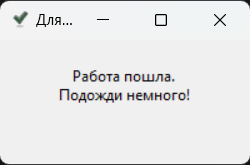
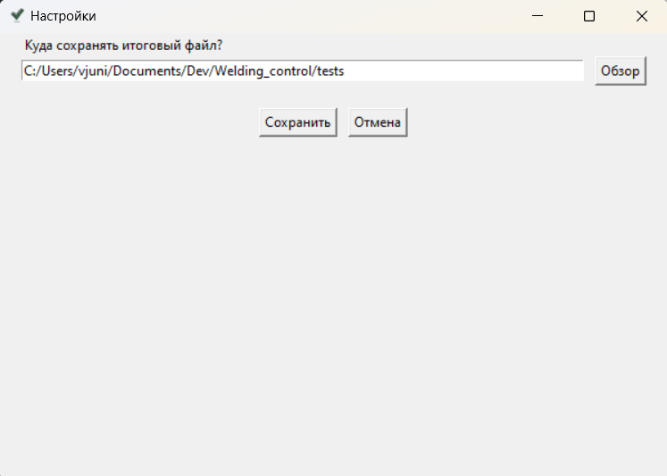
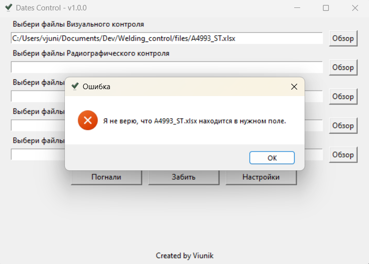

## Usage Instructions

After launching the file, a window will appear: 
 
1. In the top left corner, the name of the application and its version are displayed. The name is constant and will not change regardless of what name you assign to the executable file.
2. Next, there are 5 input text fields with hints above each and an `Browse` button on the left. Here, you enter the paths to the files for verification. It is not necessary to enter them manually. Simply click the Browse button to select <u>one or multiple files at once</u> of the same control type. Unused fields can also be left empty. The application will ignore them.
3. The `Go` button starts the verification process, which may take several minutes. During the verification, a window will appear warning that the verification has started and will disappear once the verification is complete: 
 
After the verification and the creation of the result table, another informational window will appear, indicating that the task has been completed and showing where the result table has been saved. This window needs to be closed by confirming with the `OK` button: 
 
4. The `Clear` button clears all filled fields.
5. The `Settings` button opens the settings window: 
 
Currently, in the settings, you can only specify the folder where the resulting table will be saved.

Nuances:
1. Do not start processing files for several contracts at once. One contract - one analysis. The same joint ids may appear in different contracts, which can lead to incorrect application behavior.
2. You can simultaneously select multiple files of the same control type. They must be located in the same folder. To select multiple files, hold `Ctrl` to add another file to the selection or `Shift` to add a range of consecutive files.
3. You must select files of the specific control type in the field designated for that type of control. If it says `Select Inspection Files`, do not insert `hardness test protocols` into this field; otherwise, an error window will pop up when you click the `Go` button: 

4. Each file can have an unlimited number of pages. The main thing is that these should be pages of the same control type.
5. Each page can have an unlimited number of joint ids. The main thing is that the text indicating the type of control must be in the first 10 rows on the first page. You do not need to check this manually. If the text is missing, an error will pop up (see point 3).
6. Joint ids must be specified in column A. If the cells with joint ids are merged across several columns, column A must be the first in the merge. This also does not need to be checked manually. If the joint ids are in another column, the application will simply not find them.
7. The joint control date must be to the right of the joint in the same row.