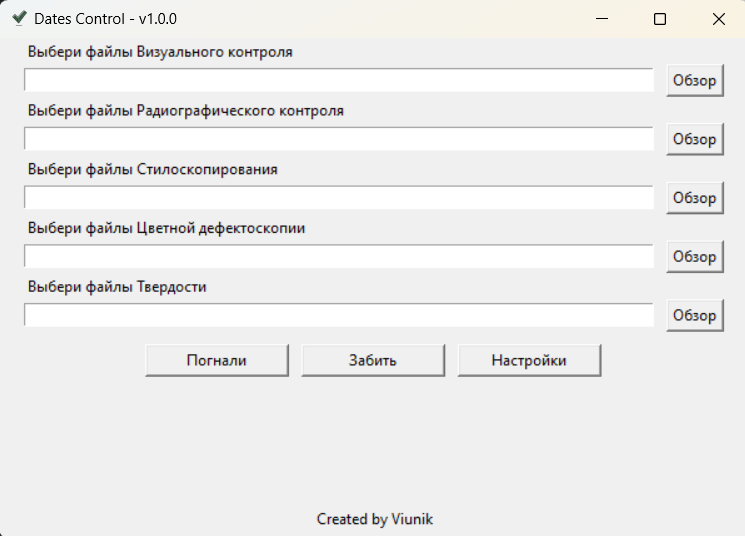
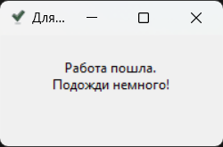
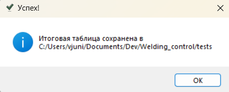
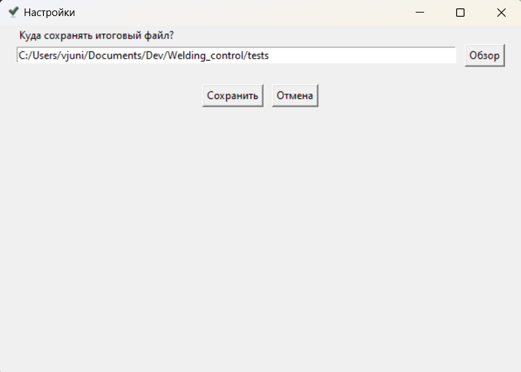
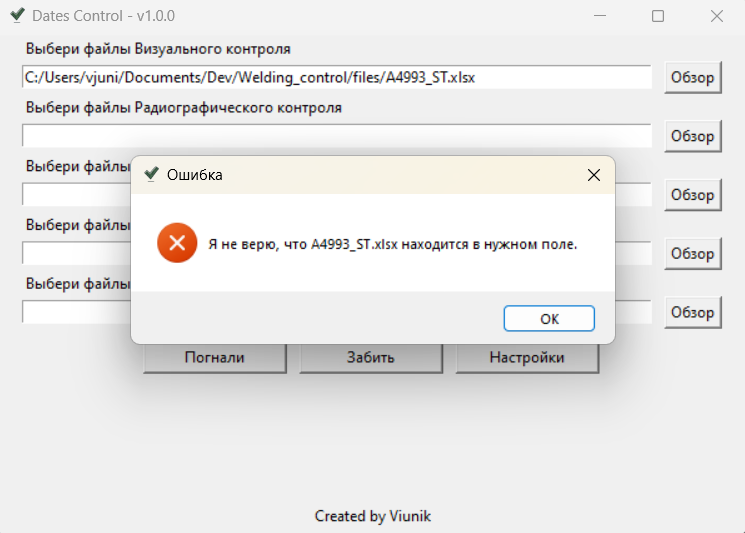

## Istruzioni per l'uso

Dopo aver avviato il file, si aprirà la finestra: 
 

1. Nell'angolo in alto a sinistra viene indicato il nome dell'applicazione e la sua versione. Il nome è fisso e non cambierà in base al nome che assegnerai al file eseguibile.
2. Seguono 5 campi di testo per l'inserimento con suggerimenti sopra ciascuno e un pulsante `Sfoglia` a sinistra. Qui vengono inseriti i percorsi dei file da controllare. Non è necessario inserirli manualmente. È sufficiente fare clic sul pulsante Sfoglia per selezionare <u>uno o più file</u> dello stesso tipo di controllo. I campi non utilizzati possono anche essere lasciati vuoti. L'applicazione li ignorerà.
3. Il pulsante `Iniziamo` avvia il processo di verifica, che può richiedere diversi minuti. Durante la verifica apparirà una finestra che avverte che la verifica è iniziata e scomparirà al termine della verifica: 
 

Al termine della verifica e della creazione della tabella dei risultati, apparirà un'altra finestra informativa che indicherà che il lavoro è completato e dove è stata salvata la tabella dei risultati. Questa finestra deve essere chiusa confermando con il pulsante `OK`: 
 

4. Il pulsante `Cancella` pulisce tutti i campi compilati.
5. Il pulsante `Impostazioni` apre la finestra delle impostazioni: 
 
Attualmente, nelle impostazioni è possibile solo specificare la cartella in cui sarà salvata la tabella dei risultati.

Note:

1. Non è necessario avviare il lavoro su file di più contratti contemporaneamente. Un contratto - un'analisi. Nei diversi contratti potrebbero ripetersi i numeri delle saldature e ciò potrebbe portare a un funzionamento errato dell'applicazione.
2. È possibile selezionare contemporaneamente più file dello stesso tipo di controllo. Devono trovarsi nella stessa cartella. La selezione di più file deve essere effettuata nella finestra di esplorazione dei file tenendo premuto `Ctrl` per aggiungere un altro file alla selezione o `Shift` per aggiungere un intervallo di file consecutivi.
3. È necessario selezionare file di un tipo specifico di controllo nel campo destinato a quel tipo di controllo. Se è scritto `Seleziona file di Stiloscopia`, non bisogna inserire in quel campo i protocolli delle `misurazioni di durezza`, altrimenti si aprirà una finestra con un errore quando si fa clic sul pulsante `Iniziamo`: 

4. Ogni file può contenere un numero illimitato di pagine. L'importante è che siano pagine dello stesso tipo di controllo.
5. In ogni pagina può esserci un numero illimitato di numeri di saldatura. L'importante è che nelle prime 10 righe della prima pagina ci sia un testo che indica il tipo di controllo. Non è necessario controllare manualmente. Se il testo non è presente, si aprirà un errore come al punto 3.
6. I numeri di saldatura devono essere indicati nella colonna A. Se le celle con i numeri di saldatura sono unite su più colonne, la prima deve essere la colonna A dell'unione. Anche questo non è necessario controllarlo manualmente. Se i numeri di saldatura si trovano in un'altra colonna, l'applicazione semplicemente non li troverà.
7. La data di controllo della saldatura deve essere a destra della saldatura nella stessa riga.