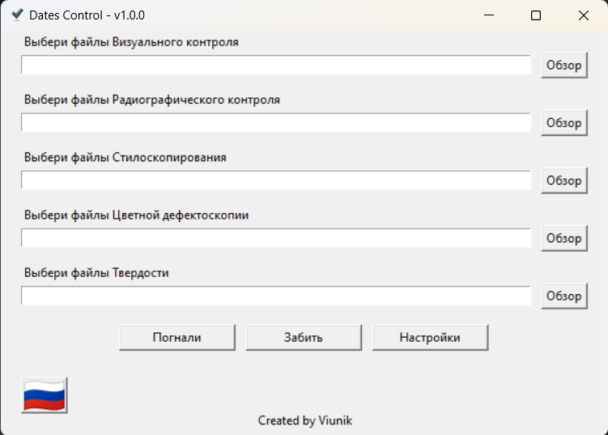
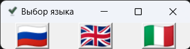
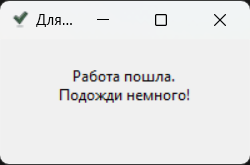
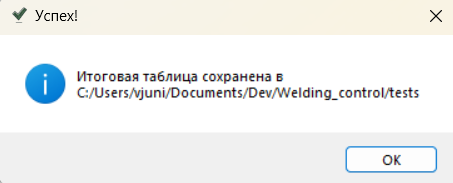
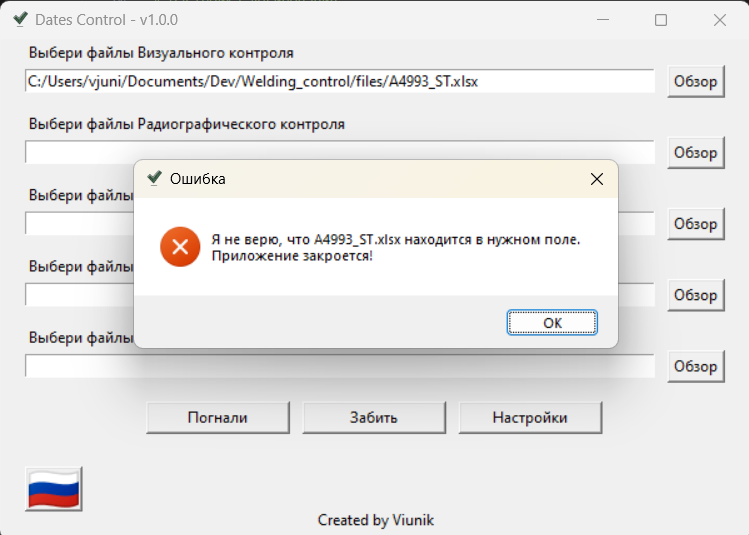

## Инструкция по использованию

После запуска файла запустится окно: 
 

1. В верхнем левом углу указано имя приложения и его версия. Имя постоянное. Оно не будет меняться в зависимости от того, какое Вы имя назначите исполняемому файлу.
2. В нижнем левом углу есть кнопка выбора языка с флагом страны, чей язык выбран текущим. Нажав на эту кнопку откроется небольшое окно с другими доступными языками: 
 
Любой из этих языков можно выбрать. При этом язык поменяется везде: в приложении, в итоговой таблице, в логах и тд.
3. Большую часть окна занимают 5 текстовых полей для ввода с подсказкой над каждым и кнопкой `Обзор` слева. Сюда вносятся пути к файлам контроля для проверки. Вручную их вносить необязательно. Достаточно нажать кнопку обзор для выбора <u>одного или нескольких сразу</u> файлов одного типа контроля. Также невостребованные поля можно оставить пустыми. Приложение их проигнорирует.
4. Кнопка `Погнали` запускает процесс проверки, который может занять до нескольких минут. На время проверки появится окно, предупреждающее о том, что проверка началась и исчезнет само по окончании проверки: 
 
По окончании проверки и создании результирующей таблицы появится еще одно информирующее окно, которое скажет, что работа выполнена и укажет, где сохранена результирующая таблица. Это окно нужно закрыть подтверждением, нажав кнопку `OK`: 
 
5. Кнопка `Забей` очищает все заполненные поля.
6. Кнопка `Настройки` открывает окно настроек: 
 

На данный момент в настройках можно только указать папку, куда будет сохранена результирующая таблица.

Нюансы:
1. Не надо запускать в работу файлы по нескольким договорам сразу. Один договор - один анализ. В разных договорах могут повторяться номера швов и это может привести к неправильной работе приложения.
2. Можно одновременно выбирать сразу несколько файлов одного и того же вида контроля. Они должны находиться в одной и той же папке. Выбор нескольких файлов необходимо делать в окне обзора файлов с зажатой `Ctrl` для добавления к выбору еще одного файла или `Shift` для добавления сразу диапазона идущих подряд файлов.
3. Необходимо выбирать файлы конкретного типа контроля в поле, которое предназначено для этого типа контроля. Если написано `Выберите файлы Стилоскопирования`, то не надо в это поле пихать протоколы замеров твердости, иначе выскочит окно с ошибкой при нажатии на кнопку `Погнали`: 

4. В каждом файле может быть сколько угодно страниц. Главное, чтобы это были страницы с одним и тем же типом контроля.
5. На каждой странице может быть сколько угодно номеров швов. Главное, чтобы в первых 10 строчках на первой странице был текст, указывающий на тип контроля. Это не надо вручную проверять. Если текста не будет, выскочит ошибка п.3
6. Номера швов везде должны быть указаны в столбце А. Если ячейки с номерами швов объединены несколькими столбцами, то первым должен быть столбец А в объединении. Это тоже не надо проверять вручную. Если номера швов будут в другом столбце, то приложение их просто не найдет.
7. Дата контроля шва должна быть справа от шва в той же строке.